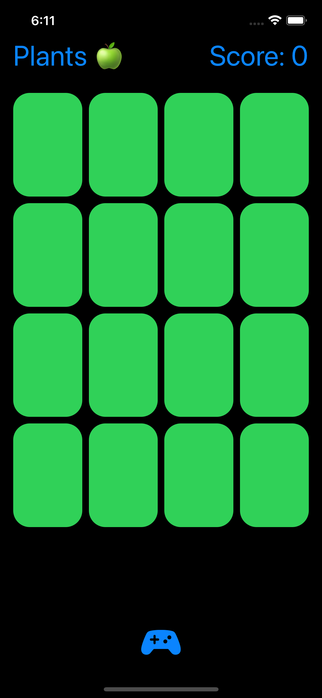

# Memorize
https://cs193p.sites.stanford.edu
Spring 2021 version of Stanford University's course CS193p (Developing Applications for iOS using SwiftUI) 

Programming Assignment 2 Finished!

More on:
https://cs193p.sites.stanford.edu

